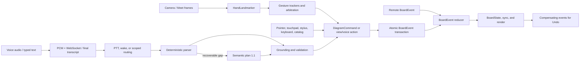

# Airboard interaction evaluation suite

This suite evaluates whether an input produces the right Airboard outcome. Its
primary oracle is the canonical final `BoardState` and canonical `BoardEvent`
delta, together with selection, viewport, feedback, routing, exact-once, and
Undo checks. Transcript wording, model prose, and an `applied` telemetry event
are diagnostics; none is sufficient evidence of success.

V1 is English-only. Indian English is a mandatory primary slice.

## Production pipeline under evaluation



The application and evaluator share the production parser, semantic schema and
capability registry, board reducer, command-turn coordinator, gesture-frame
coordinator, and landmark replay code. Evaluator-only allowlists or copied
contract versions are prohibited.

The semantic seed corpus also declares the production prompt version. Corpus
validation imports that version from the API contract and fails when prompt and
corpus drift, so a prompt change cannot silently reuse stale expectations.

Audio evaluation does not stop at transcript or action-name scoring. After
routing, parsed operations pass through production grounding and
`commitCommandTurn`, producing real `DiagramCommand` and `BoardEvent` values.
The audio oracle checks canonical final board state, event delta, board
effects, selection, atomic application, and a one-step Undo round trip.

## Behavior contract

- A supported, structurally complete, uniquely grounded command executes
  immediately and is one-step undoable.
- Semantic interpretation may repair acoustic errors, disfluency, synonyms,
  and narrative phrasing, but may return only registered typed actions.
- An ambiguous target, missing required slot, or destructive target that must
  be inferred produces one focused clarification and no mutation.
- Off-domain or unavailable work produces `unsupported`, actionable feedback,
  and no mutation.
- Provider errors, malformed output, stale context, repeated final
  transcripts, hidden or paused editing, and lost authorization never mutate
  the board.
- Resolution is based on structural completeness, unique grounding, action
  risk, and validation. Model-reported confidence is not an execution signal.

An interaction case passes only when its route, processing stages, required and
forbidden actions, event cardinality, canonical state, non-board state,
feedback category, latency budget, and Undo round trip all pass.

Every interaction result also carries `evidenceProvenance`. Voice transcript
cases that actually traverse `VoiceCommandRouter`, the production parser and
grounder, `commitCommandTurn`, and Undo may be marked `production-route`.
Pre-grounded direct/gesture commands, recorded semantic responses, and
reducer-only remote events remain useful offline regressions but are explicitly
non-release evidence. Release aggregation fails closed unless separate
production-route results cover contract/exact-once, safety, atomicity, and
Undo.

## Repository layout

| Path | Purpose |
| --- | --- |
| `schema/interaction-eval-case.v1.schema.json` | Versioned multimodal input and oracle envelope |
| `schema/interaction-eval-result.v1.schema.json` | Stage timings, plan, commands, events, state, Undo, versions, cost, and failure taxonomy |
| `interactions/v1.json` | Canonical full-pipeline and cross-modal cases |
| `voice-intent/` | Production semantic contract seeds and meeting-style negatives |
| `provider-events/` | Redacted STT/provider protocol replay |
| `audio/` | Audio scenario contract and restricted-asset manifest |
| `gesture/` | Landmark replay contract and restricted-asset manifest |
| `capability-coverage/` | Evidence matrix for shipped actions, nodes, references, channels, gestures, and surfaces |
| `datasets/participant-splits.v1.json` | Participant/session-held-out split and deletion ledger |
| `quality-gates/release.v1.json` | Versioned release thresholds and pinned baseline reference |
| `quality-gates/blessed-baseline.v2.json` | Hash-, version-, and policy-bound comparison artifact; explicitly not media or run evidence |

Physical markers and air writing are legacy, non-runtime inputs. The capability
contract prevents them from silently becoming production owners.

SemanticPlan 1.1 continues to require at least one action for `resolved`.
Supported relationship requests that are already fully present use the
HTTP/orchestration outcome `already_satisfied` with `plan: null`. Evaluators
score that outcome against the same canonical board oracle and require zero
events, unchanged selection, and no Undo entry.

Capability coverage uses the fail-closed `capability-coverage.v2` contract.
Corpus evidence names one exact production capability, its facet, an
executable provenance class, and JSON Pointer assertions into the tested input
or oracle. Meeting negatives receive credit only for action/node terms that
actually occur in that utterance; an ambient sentence never covers the whole
registry. Interaction `capabilities` and tags are discovery metadata only and
do not grant behavioral facets. Static evidence must resolve to an executable
unit/browser test, name exact capabilities (wildcards are rejected), and carry
a capability-specific rationale. Reports preserve the evidence ID, source,
assertion paths, and provenance for every credited facet.

## Commands and tiers

| Command | Intended use | Provider/media policy |
| --- | --- | --- |
| `pnpm eval:pr` | Every PR: schemas, policy, coverage, deterministic text, grounded negatives, mocked pipelines, provider replay, landmark replay, properties, seeded faults, and core Chromium journeys | Fully offline; blocking |
| `pnpm eval:canary` | Prompt, model, STT, routing, or threshold changes | Full 33-case semantic seed corpus plus a diversity-first maximum of 30 regression audio/Meet cases; protected providers/media; safety failures block |
| `pnpm eval:nightly` | Full semantic corpus at three repetitions for baseline and candidate models, their blocking comparison, ambient negatives, regression-split live audio/gesture replay, and recorded-video browser/Meet journeys | Protected keys and encrypted media mount |
| `pnpm eval:device` | Weekly and pre-release physical camera/microphone smoke, HandLandmarker health, OS journeys, and independently attested Meet bridge matrix | Approved real-device runner |
| `pnpm eval:release` | The complete offline deterministic/negative/provider/fault gates plus five semantic repetitions, sealed holdout audio/ambient and gesture assets, holdout recorded-video journeys, races, and advertised surfaces | Strict protected evidence; blocking |

Useful focused commands include:

```sh
pnpm eval:interactions
pnpm eval:contract
pnpm eval:provider-events
pnpm eval:semantic
pnpm eval:semantic-negatives
pnpm eval:audio
pnpm eval:gesture
pnpm eval:faults
pnpm eval:coverage
pnpm eval:quality-report
pnpm eval:quality
```

`pnpm eval:pr -- --skip-browser` is the fast offline diagnostic variant; it is
not the merge gate. Set `AIRBOARD_EVAL_RUN_ID` to obtain a stable artifact
directory. Nightly comparison requires distinct
`AIRBOARD_EVAL_BASELINE_MODEL` and `AIRBOARD_EVAL_CANDIDATE_MODEL` values.

The `live-provider-evals` GitHub environment must restrict access to its
`eval-media` self-hosted runner and provide:

- secrets `AIRBOARD_EVAL_OPENAI_API_KEY`,
  `AIRBOARD_EVAL_DEEPGRAM_API_KEY`, and optionally
  `AIRBOARD_EVAL_API_TOKEN`;
- variables `AIRBOARD_EVAL_MEDIA_ROOT`,
  `AIRBOARD_EVAL_INTENT_ALLOWED_MODELS`,
  `AIRBOARD_EVAL_BASELINE_MODEL`, `AIRBOARD_EVAL_CANDIDATE_MODEL`,
  `AIRBOARD_EVAL_INPUT_USD_PER_MILLION`, and
  `AIRBOARD_EVAL_OUTPUT_USD_PER_MILLION`.

Provider keys are inherited by the localhost API and unset before evaluator and
browser children start. API logs live in the runner temporary directory, are
deleted at step exit, and are never part of artifact upload.
Internal pull requests that touch the semantic prompt/schema, transcription,
routing, gesture perception, or their corpora automatically request the
protected canary job. Fork pull requests do not receive protected-provider
access.

## Protected real-device station

`eval:device` fails before opening media unless it runs on macOS or Windows
with both physical-device opt-ins, a stable station ID, and station-specific
expected camera and microphone label patterns. Its dedicated Playwright smoke
test grants the local Airboard origin permission, acquires camera and
microphone tracks without fake-device launch flags, rejects known
fake/virtual/logical-default identities, verifies live settings and advancing
camera frames, then starts the camera from Airboard's production settings UI.
It requires multiple successful `HandLandmarker` inference frames in the
production gesture journal. It records no audio/video, screenshots, traces, or
media-derived content.

The protected `device-evals` environment provides:

- macOS secrets `AIRBOARD_EVAL_MACOS_DEVICE_ID`,
  `AIRBOARD_EVAL_MACOS_CAMERA_LABEL_PATTERN`,
  `AIRBOARD_EVAL_MACOS_MICROPHONE_LABEL_PATTERN`, and
  `AIRBOARD_EVAL_MACOS_MEET_ATTESTATION_PATH`;
- corresponding Windows secrets with the `AIRBOARD_EVAL_WINDOWS_` prefix.

Each attestation path is absolute and lives outside its station checkout.

`AIRBOARD_EVAL_MEET_BRIDGE=1` is only an opt-in and is never treated as proof.
The station-owned JSON at the attestation path must use
`airboard-meet-station-attestation.v1`, bind to the configured device, be less
than two hours old and unexpired, include positive compositor/sender/frame/byte
deltas, and include an independent second-participant or receiver-station
observation of the expected overlay. It must declare that no content or raw
media was retained and identify the meeting only by a SHA-256 hash. The
attestation itself is not copied into CI artifacts. Its exact field contract is
versioned in `evals/schema/meet-station-attestation.v1.schema.json`.

The weekly and GitHub-prerelease triggers run a fail-independent macOS/Windows
matrix. Station automation must refresh each receiver attestation before the
window or that matrix leg fails closed. Manually dispatched runs additionally
require the workflow confirmation input. This gate proves the enumerated
hardware and current browser pipeline on each station, but cannot establish
that every driver presenting a physical-looking label is genuine; protection
of the runner plus station-specific label binding remains part of the trust
boundary.

## Provider adapters

Audio scenarios run unchanged through four adapters:

- `fake`: deterministic final/partial events for fast contract tests.
- `deepgram-replay`: privacy-reviewed provider messages, including duplicate
  finals and transport edge cases.
- `live-websocket`: the production Airboard gateway with mounted WAV assets
  recorded for non-Meet surfaces.
- `meet-bridge-replay`: mounted Meet WAV assets replayed as Float32
  `audio-chunk` messages through the production Meet bridge parser and the
  production realtime speech session before reaching the live gateway.

Meet transport is fail closed: assets tagged `meet-main-stage`,
`meet-side-panel`, `meet`, or `meet-bridge` must declare
`sttEvaluation.transport: "meet-bridge"` and are assigned only to
`meet-bridge-replay`. A direct WebSocket upload may not claim a Meet surface.
Non-Meet external assets declare `sttEvaluation.transport: "direct"`.

Semantic scenarios use the production API with either its configured model or
an explicitly allowlisted model. A transient provider request is retried once
inside the evaluator. Provider/infrastructure failures are reported separately
from understanding failures; more than 5% makes a live run inconclusive and
cannot produce a pass.

Examples:

```sh
node scripts/eval-audio-stt.mjs --adapter deepgram-replay
node scripts/eval-audio-stt.mjs \
  --adapter live-websocket \
  --adapter meet-bridge-replay \
  --require-assets \
  --dataset-split regression \
  --media-root /approved/read-only/eval-media
node scripts/eval-gesture-replay.mjs \
  --dataset-split regression \
  --media-root /approved/read-only/eval-media
node scripts/eval-voice-intent.mjs --attempts 5 --model MODEL_ID
```

Both media CLIs accept
`--dataset-split development|regression|holdout`. Recorded-video browser replay
uses `AIRBOARD_EVAL_DATASET_SPLIT` for the same selection. Nightly pins all
participant-linked media to `regression`; release pins it to the sealed
`holdout`. A requested split with no matching audio or landmark assets fails
instead of falling back to another split.

## Semantic baseline/candidate comparison

Nightly runs the same materialized metamorphic corpus three times per case
against the configured baseline and candidate models. It stores the inputs at:

```text
model-comparison/baseline/semantic/semantic-metamorphic.json
model-comparison/candidate/semantic/semantic-metamorphic.json
```

`eval-semantic-comparison.mjs` verifies that dataset hashes, case counts,
attempt counts, and critical-slice inventories match before comparing quality.
It blocks when candidate core accuracy is below 95%, overall accuracy is below
90%, any candidate case misses its repetition policy, a critical slice drops
more than three percentage points, or observed cost per successful turn
regresses more than 10%. Provider-infrastructure failure rates above 5% make
the comparison inconclusive rather than an understanding failure.

The comparison emits
`model-comparison/semantic-comparison.[json|xml|md|html]`, including metric
deltas, per-critical-slice results, provider diagnostics, and a replay command.

## Datasets, annotations, and privacy

Raw audio/video and person-linked landmark traces must not enter Git, general
CI artifacts, screenshots, Playwright traces, or server logs. Store them in
encrypted restricted storage and expose a read-only mount through
`AIRBOARD_EVAL_MEDIA_ROOT`. Commit only opaque asset IDs, SHA-256 hashes,
consent scope, redacted annotations/transcripts, participant and session split
keys, and deletion keys.

Human data requires explicit benchmark-retention and provider-processing
consent. Two annotators independently label real failures and an adjudicator
resolves disagreements. LLM judging may assist diagnostics but never decides a
safety gate.

Split participants and meeting sessions 60/20/20 into development, regression,
and sealed holdout sets. Every participant-linked asset must declare
`datasetSplit` matching its participant record and a `meetingSessionId` listed
for that participant. No participant or meeting session may cross splits.
Deletion by participant ID must remove every asset and annotation from every
dataset version. Development is for corpus construction, nightly uses
regression, and release consumes only the sealed holdout.

### Audio asset contract

Each restricted audio asset uses a relative `storageKey` below
`AIRBOARD_EVAL_MEDIA_ROOT` and a lowercase SHA-256. Release assets must also
declare:

- `participantId`, `meetingSessionId`, and `datasetSplit`;
- `language: "en"`, `accent`, `microphone`, `distance`, non-empty
  `conditions`, `lengthClass`, and `surface`;
- privacy classification plus granted benchmark-retention and
  provider-processing consent;
- two independent annotator IDs and completed adjudication when they
  disagreed;
- `sttEvaluation.channel`, its transcript/action oracle, a grounded board
  `context`, and a `finalState` constraint;
- `sttEvaluation.transport: "direct"` for standalone captures or
  `"meet-bridge"` for Meet-tagged captures;
- `purpose` and a positive `durationSeconds` for ambient-safety recordings.

Fake, provider-event replay, and mounted WAV cases use the same downstream
oracle. A correct transcript still fails when production grounding chooses the
wrong target, the committed canonical graph or event delta is wrong, the
transaction is not exact-once, or Undo does not restore the pre-turn board.

### Gesture storage and recorded-video replay

Deidentified derived landmark traces may be checked into the repository or
kept in restricted storage. A derived asset must have granted evaluation
consent, no embedded raw media, `sourceAssetIds`, and exactly one of:

- a repository-relative `repositoryPath`; or
- a relative `storageKey` resolved beneath `AIRBOARD_EVAL_MEDIA_ROOT`.

Both restricted audio and gesture paths are resolved with real paths after
mounting and are rejected if a symlink or path traversal escapes the media
root.

Recorded gesture video has a separate browser-owned contract. It must be a
privacy-approved, Chromium-compatible Y4M fixture with
`assetClass: "restricted_raw_media"`, `artifactType: "video"`,
`contentType: "video/x-y4m"`, a relative `.y4m` `storageKey`, an external
reference, explicit consent/privacy metadata, and
`annotations.evaluationOwner: "browser_video_replay"` with a
`browserReplay` oracle. Positive assets enumerate exact
`expectedAppliedActions` gesture/count pairs; neutral-safety assets enumerate
none and set the maximum board-event count to zero. Claimed valid repetitions
cannot exceed the number of expected applied actions. Chromium receives the
video through fake video capture, then
the application processes it through the production camera ingestion path,
HandLandmarker, gesture arbitration, and board/view effects. The browser
verifies the mounted hash plus perception-frame counts, required stages/owners,
forbidden gesture actions, exact applied-action counts, board-event/object
bounds, moved/created/deleted object deltas, viewport pan/scale change, final
visibility/selection, and Undo depth.
Scenarios that need targets or Undo history may declare bounded
`browserReplay.setup.deterministicWakeTranscripts` (plus optional initial
viewport/visibility). Setup runs through the production command route before
camera replay; the harness then clears the event/telemetry journals so setup
mutations can never be credited as gesture outcomes.

The Playwright `gestureVideoReplay.spec.ts` journey writes one content-free
JSON record only after every asset assertion passes. That record is bound to
the run ID, corpus hash, asset hash, and split and contains aggregate
stage/owner/action and board counters—never participant/session IDs, paths,
frames, landmarks, labels, or raw media. The gesture evaluator independently
rechecks the record against the manifest before it counts that participant,
repetition, neutral minute, or quality slice. Missing, duplicate, stale,
wrong-hash, or action-mismatched records fail the release; an unmerged video
remains explicitly `delegated_browser_replay`.

Release dataset policy requires a browser-owned recorded-video asset for every
gesture participant. Human coverage can otherwise come only from a consented
derived landmark trace that the evaluator actually replays. The current trace
engine substantiates only low-level palm/grab acquisition, so derived traces
may claim release repetitions only for `manipulation_grab`. Navigation,
visibility, voice gating, hold-to-edit, and neutral full-pipeline safety require
browser-owned Y4M evidence. A manifest annotation, unsupported media type, or
synthetic trace cannot replace an observed holdout replay.

Release coverage fails closed unless the manifests and reports prove:

- at least 24 English speakers, including at least 8 Indian-English speakers,
  required microphones, distances, noise/overlap/cutoff conditions, command
  lengths, and advertised surfaces;
- at least 30 hours of consented meeting-style ambient audio;
- at least 24 gesture participants, three valid repetitions per shipped gesture
  per core condition, ten neutral/bystander minutes per participant, and
  browser-owned recorded-video evidence for each participant.

The checked-in audio manifest intentionally contains no fabricated participant
data. Release evaluation will fail until approved media and sealed annotations
are mounted and their manifest hashes match.

## Release gates

| Area | Gate |
| --- | --- |
| Contract, exact-once, atomicity, stale-context/provider safety, Undo | 100% |
| Text/ambient hard false actions | Zero; ambient set at least 30 hours |
| Semantic core / overall | At least 95% / 90%; critical slices at least 85% |
| Semantic repetitions | Ordinary cases at least 4/5; destructive, unsupported, clarification, and safety cases 5/5 |
| Unsupported and destructive wrong-target precision | 100% |
| STT command-critical token recall | At least 97%; WER/CER remain diagnostic |
| Audio downstream action | Routed actions must ground, atomically commit to the expected canonical graph/event delta, and pass Undo |
| Gesture precision / recall | At least 95% / 90%; no critical slice below 85% |
| Critical gesture false triggers | Zero for retired gesture-sourced Undo, erase, visibility, and voice gating |
| Gesture duplicates | Below 1%; acquisition/release within debounce plus two observed frames |
| End-of-speech to action p95 | Under 1 s deterministic; under 2.5 s semantic |
| Cost | Cost per successful semantic turn no more than 10% above baseline |
| Regression | No critical slice drops by more than 3 percentage points |

The quality aggregator promotes only explicit measurements. Planner latency is
kept as a diagnostic and is never substituted for end-to-action latency.

## Artifacts, aggregation, and replay

Every composite run writes privacy-safe JSON, JUnit XML, Markdown, and HTML to
`artifacts/evals/<run-id>/`. Reports contain the dataset hash, commit,
environment, provider/model/prompt/schema versions, aggregate and slice
metrics, latency/cost distributions when observed, safe state diffs, failure
taxonomy, and replay commands. They exclude raw media and customer content.

A release run must generate these six strict source artifacts:

```text
interactions/interaction-results.json
semantic/semantic-contract.json
semantic/semantic-metamorphic.json
semantic/semantic-ambient-safety.json
audio/audio-results.json
gesture/gesture-results.json
```

It then writes `airboard-quality-report.v1.json` and evaluates it into
`airboard-quality-gate-result.v1.json`. Missing, malformed, stale, unevaluated,
or insufficient evidence fails closed. The PR quality-report command is
explicitly `config_only`: it validates policy without claiming protected media
exists. The release audio and gesture source reports identify
`datasetSplit: "holdout"` and expose only coverage measured from evaluated
holdout assets.

Replay a whole run with the command in `suite-results.json`. For a generated
semantic case, invoke `eval-semantic-metamorphic.mjs` or
`eval-semantic-negatives.mjs` with `--live --case CASE_ID`; do not reuse the
temporary materialized fixture path. Other source artifacts contain a direct
replay command. Pin a new blessed baseline only through a reviewed change to
both `quality-gates/release.v1.json` and its referenced
`quality-gates/blessed-baseline.vN.json`. Loading verifies the artifact’s
canonical digest, baseline version, config version, report schema, exact
release-policy digest, metrics digest, and non-evidentiary provenance against
evaluator pins. The reference deliberately asserts neither restricted-media
availability nor that an evaluation run occurred. A new critical slice
reported by a candidate fails closed until the reviewed baseline artifact has
a comparator for it.

## Metamorphic cases and seeded faults

Property coverage includes casing/courtesy invariance, paraphrase equivalence,
board ID/order invariance, irrelevant-object additions, duplicate labels,
repeated finals, timing-boundary sweeps, FPS/dropout sweeps, and typed/voice
parity.

`pnpm eval:faults` proves the evaluator catches all required seeded faults:
duplicate final transcript, wrong-label grounding, stale semantic response,
malformed model output, audio-frame drop, two-hand false blocking, gesture
threshold bypass, camera loss during grab, inference exception, remote-event
race, and broken Undo. A seeded fault passing silently is itself a blocking
evaluator defect.

## Adding a regression

1. Reproduce the failure through a production-used seam.
2. Add or derive a privacy-safe fixture with a stable ID, corpus version, asset
   hash, modality/channel/surface/risk tags, timed inputs, and canonical oracle.
3. Add capability evidence and required positive, negative, grounding, and
   final-state coverage where applicable.
4. Confirm the case fails before the product fix and passes afterward.
5. Run `pnpm eval:pr`; use the matching protected tier for provider or media
   evidence.

Every confirmed consented production failure should become a regression case
within two working days.
